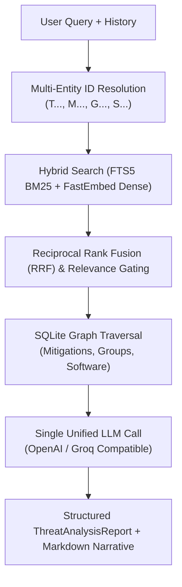

# Cypher AI  MITRE ATT&CK Threat Intelligence Engine

Cypher AI is an authoritative cybersecurity threat intelligence and reasoning platform powered by a **deterministic Graph-RAG pipeline** grounded strictly in the official MITRE ATT&CK enterprise knowledge graph.

---

## Key Features

- **Hybrid Search & Reciprocal Rank Fusion (RRF)**: Combines dense semantic vector retrieval (BAAI/bge-small-en-v1.5 via FastEmbed) with sparse full-text search (SQLite FTS5 / BM25).
- **Knowledge Graph Reasoning Engine**: Multi-hop graph traversal mapping incidents across tactics, techniques, mitigations, adversary threat groups, and software tools.
- **Strict Grounding & Zero Hallucination**: AI narrative generation is constrained strictly to verified MITRE ATT&CK graph entities.
- **Real-Time Thread Context & Multi-Turn Reasoning**: Follow-up questions (e.g., *"why"*, *"how does M1025 mitigate it?"*) inherit conversational context with dedicated thread isolation.
- **Interactive Cyber Threat Matrix UI**: Glassmorphic dark-mode dashboard built with React and Vite featuring modal deep-dives, tactic stage mapping, and incident history.

---

## Architecture Flow



---

## Quickstart Guide

### 1. Prerequisites
- Python 3.10+
- Node.js 18+ and npm
- Groq or OpenAI API Key

### 2. Backend Setup
```bash
# Clone the repository
git clone https://github.com/amdraihaan2005/cypher.git
cd cypher

# Install Python dependencies
pip install -r requirements.txt

# Configure environment variables
copy .env.example .env
# Edit .env with your OPENAI_API_KEY
```

### 3. Start Backend Server
```bash
python scripts/run_server.py --port 8000
```
- API is live at `http://localhost:8000`
- Interactive OpenAPI Docs: `http://localhost:8000/docs`

### 4. Start Frontend
```bash
cd frontend
npm install
npm run dev
```
- Frontend will be live at `http://localhost:5173`

---

## Tech Stack

- **Backend**: FastAPI, SQLite3 (FTS5), FastEmbed (ONNX), NumPy, Pydantic v2
- **Frontend**: React 18, Vite, Lucide Icons, Vanilla CSS
- **Data Source**: MITRE ATT&CK Enterprise STIX 2.1 Dataset
